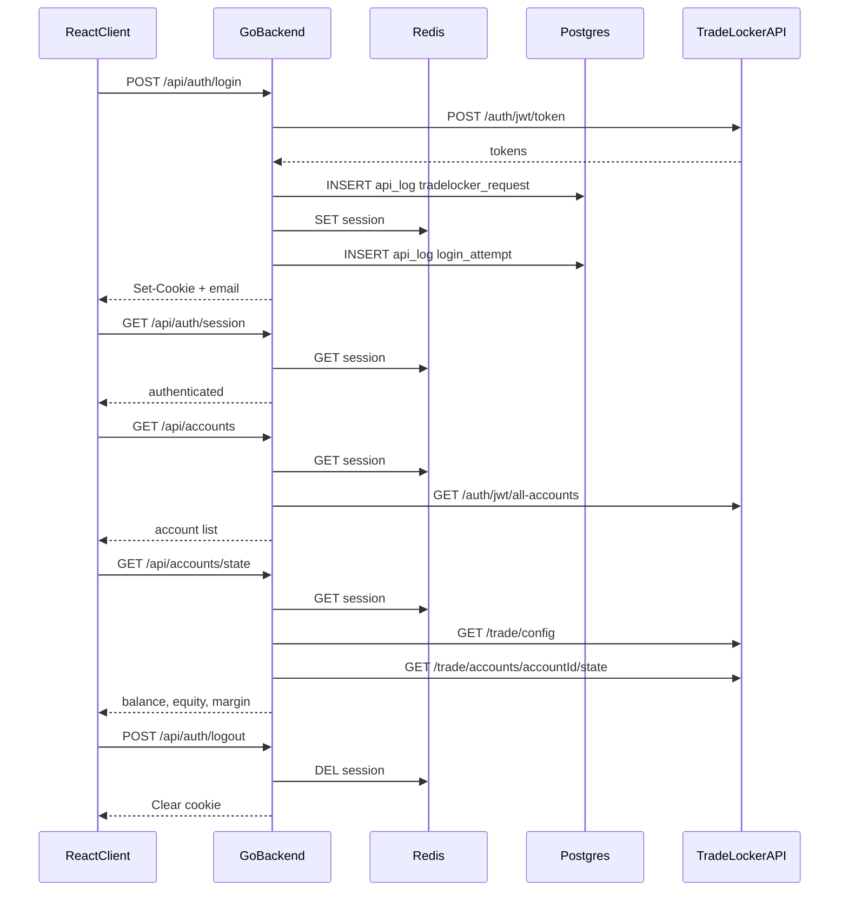

# e8markets

Full-stack TradeLocker integration — React client, Go API, Postgres, Redis. Dev stack runs entirely in Docker via `make dev`.

`client/` · `server/` · [`scripts/dev.sh`](scripts/dev.sh)

## Features

- **TradeLocker auth** — login/logout via a custom HTTP client (no SDK); tokens stored server-side in Redis
- **Session handling** — HttpOnly cookie, TTL aligned to token expiry, automatic refresh before protected requests
- **Protected routes** — unauthenticated users redirect to `/login`; session restored on refresh
- **Accounts dashboard** — list TradeLocker accounts, pick one, view balance / equity / margin and related fields
- **Backend-only TL calls** — the browser talks to our API; TradeLocker is never called from the frontend
- **Audit logging** — login attempts and TradeLocker API requests persisted to Postgres (`api_logs`)

## Not yet

- Symbol selection
- Position state history

## Stack

| Layer | Tech |
|-------|------|
| Frontend | React, TanStack Router & Query, Vite |
| Backend | Go, custom TradeLocker client |
| Data | Postgres (logs), Redis (sessions) |
| Dev | Docker — infra + API + client via [`scripts/dev.sh`](scripts/dev.sh) |

## Auth flow

The frontend orchestrates a few focused REST endpoints. TradeLocker JWTs never leave the server — the client only holds an opaque `session_id` cookie.

Protected routes read the session from Redis first; the API may refresh the token via TradeLocker if it is near expiry.



**After login:** the dashboard loads accounts immediately, selects the first (or lets you pick), then fetches state for that account only. Switching accounts refetches state, not the full list.

**Storage:** Redis for ephemeral sessions; Postgres for durable API logs.

## Getting started

Needs Docker, Make, and curl.

```bash
make dev    # start
make stop   # stop
make reset  # stop + wipe DB
```

Or: `./scripts/dev.sh`

- App: http://localhost:5173
- API: http://localhost:8080/health
- DB: http://localhost:9901/?pgsql=postgres-db&username=postgres&db=e8markets&ns=public

First run copies `.env.example` → `.env.local`. TradeLocker demo credentials are entered at login — not stored in env files.
