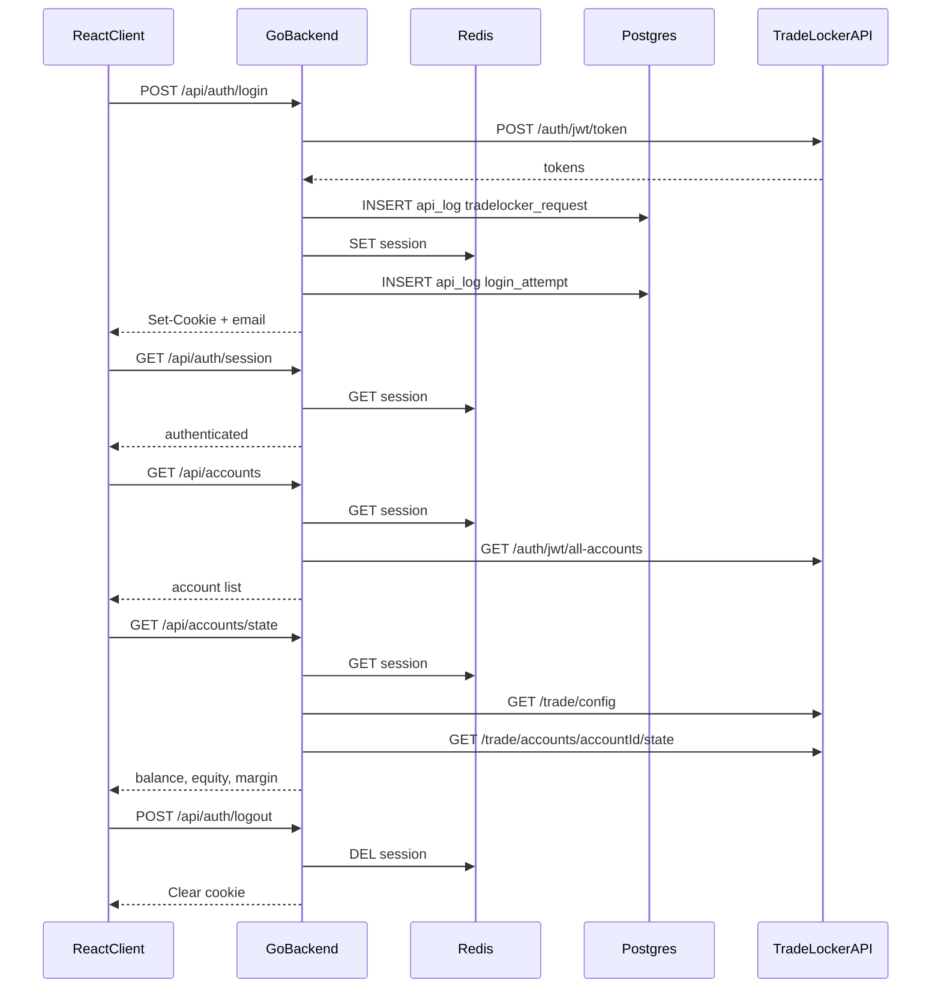

# e8markets — extended documentation

Companion to the root [README](../README.md). Assignment brief: [assignment.pdf](assignment.pdf).

## Assignment coverage

### Must-have (implemented)

| Requirement | Implementation |
|-------------|----------------|
| **1. TradeLocker login** | `POST /api/auth/login` → custom Go HTTP client (`server/internal/tradelocker`); tokens in Redis; expiry tracked; failed logins logged |
| **2. Login state** | HttpOnly `session_id` cookie; `GET /api/auth/session`; protected routes; logout clears session |
| **3. Account information** | Dashboard shows balance, equity, margin fields, account ID / acc num; multi-account picker when needed |
| **4. Symbol selection** | Instruments fetched from TradeLocker; searchable dropdown; filters open positions and snapshot history by symbol |
| **5. Position state history** | Manual **Sync positions** + auto-sync every 3 minutes (tab visible); snapshots in `position_snapshots`; history card reads from DB |
| **6. Backend logging** | `api_logs` (login attempts, outbound TL requests, failures); `sync_runs` for sync outcomes; request timing on stdout |
| **7. Docker** | Postgres, Redis, Adminer via Compose; API and client via [`scripts/dev.sh`](../scripts/dev.sh); `.env.example` → `.env.local` |
| **8. GitHub delivery** | Root README, setup, Docker, architecture, limitations |

**Restriction:** no TradeLocker SDK — only project-owned HTTP/JSON integration.

### Suggested app flow

| Step | Status |
|------|--------|
| Open app → login | Done |
| Backend authenticates with TradeLocker | Done |
| Fetch accounts → select account | Done (auto-selects when only one) |
| Display account info | Done |
| Fetch tradable symbols → select symbol | Done |
| Display current position state | Done (live from TL; filterable by symbol) |
| Sync / store position snapshots | Done (manual + periodic auto-sync) |
| Sync / store **closed trades** history | **Not implemented** |
| Display stored history from app DB | Done (`GET /api/positions/history`) |

### Could-have (optional)

| Feature | Status |
|---------|--------|
| Historical price chart | Not implemented |
| OpenAPI + shared types | Not implemented — API types are hand-written in Go and TypeScript separately |
| Token refresh | Implemented — backend refreshes before expiry (~60s buffer) |
| Background sync job | Partial — client polls every 3 min when tab visible (`onlyIfNew`); no server cron |
| Richer error UX | Partial — login/sync/API errors in UI; auto-sync rate limits fail silently |

## Features

- TradeLocker login/logout via custom client; tokens server-side in Redis
- HttpOnly session cookie; protected routes; session restore on refresh
- Accounts dashboard — balance, equity, margin; account picker when multiple accounts
- Instruments — browse/search symbols; filter positions and history
- Live open positions from TradeLocker; manual sync → Postgres snapshots
- Position history from DB (survives reload); filter by selected symbol
- Audit tables: `api_logs`, `sync_runs`, `position_snapshots`

## Auth flow

TradeLocker JWTs never leave the server. The client holds only an opaque `session_id` cookie.



After login: load accounts → select first or user choice → fetch state, instruments, positions → optional symbol filter.

## Project layout

| Path | Role |
|------|------|
| `client/` | React app |
| `server/` | Go API |
| `server/internal/tradelocker/` | TradeLocker HTTP client |
| `server/docker/` | Compose for Postgres, Redis, Adminer |
| `scripts/dev.sh` | Dev orchestration (`make dev` / `stop` / `reset`) |

Snapshot rows store position fields in JSONB (ID, side, qty, avg price, etc.).

## CI

GitHub Actions (`.github/workflows/ci.yml`):

- **pull_request** — when the PR targets `main` (merge gate; runs on open, update, reopen)

| Job | Checks |
|-----|--------|
| **server** | `gofmt`, `go vet`, `go test -race`, `go build` |
| **client** | `pnpm lint` (Biome), `pnpm test`, `pnpm build` |

Enable **branch protection** on `main` and require `Server (Go)` + `Client (React)` to block merges until green.

## Testing

```bash
cd server && go test ./...
cd client && pnpm test
```

| Area | Coverage |
|------|----------|
| Backend routes / auth | Router tests with mock TradeLocker + in-memory Redis |
| TradeLocker client | Client and types unit tests |
| Frontend | Vitest — login form, dashboard cards, error helpers |
| DB persistence | Indirect via server integration tests; no dedicated migration suite |

## Inspecting logs

### Docker (stdout)

```bash
docker logs -f e8m-server
```

Request lines (`GET /api/... 12ms`) and handler errors.

### Postgres (Adminer)

Open Adminer from README URLs, then:

| Table | Contents |
|-------|----------|
| `api_logs` | Login attempts, outbound TradeLocker calls |
| `sync_runs` | Position sync outcomes (`success` / `failure` / `skipped`) |
| `position_snapshots` | Position JSON per sync run |

#### `api_logs`

| `event_type` | Meaning |
|--------------|---------|
| `login_attempt` | Login success or failure |
| `tradelocker_request` | Outbound TradeLocker call |

```sql
SELECT created_at, event_type, method, path, status_code, message
FROM api_logs
ORDER BY created_at DESC
LIMIT 20;
```

Failed-login `message` may contain truncated TradeLocker text — not the submitted password.

#### `sync_runs`

```sql
SELECT created_at, account_id, acc_num, status, records_stored, error_message
FROM sync_runs
ORDER BY created_at DESC
LIMIT 20;
```

### Not logged

- Passwords, JWTs, refresh tokens, session cookie values
- Full TradeLocker error bodies (truncated to 500 chars in `api_logs.message`)

### Quick verification

1. Log in → `api_logs` `login_attempt` with `status_code = 200`
2. Load dashboard → `tradelocker_request` rows
3. Sync positions → `sync_runs` row; `records_stored` or `skipped`

## Known limitations (detail)

See also the root [README](../README.md). Additional notes:

- **No shared BE/FE types** — the REST contract is not described by an OpenAPI document; there is no generated client or shared schema. Frontend types in `client/src/lib/api.ts` and backend structs are kept in sync manually. OpenAPI type generation would have been a reasonable could-have to reduce drift.

## Assumptions

- Demo account via E8 Markets portal discount code (see assignment).
- Single-account accounts hide the account switcher with a short note.
- Incremental Git commits during development (per assignment expectation).
